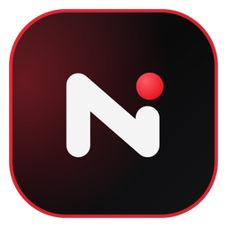

<div align="center">



# Niko

**Seu sistema de vida para Windows.**

Rotina, estudos, finanças, metas e os serviços que você acompanha, reunidos em um só lugar e cuidados por um time de agentes com personalidade própria.


</div>

---

## Sobre

O Niko é um aplicativo desktop que fica junto do Windows, e não dentro de uma aba do navegador. Ele aparece em três camadas:

| Camada | Onde fica | Para que serve |
| ------ | --------- | -------------- |
| **Ilha** | Topo da tela | Mídia tocando, pomodoro, tarefas do dia, captura rápida e avisos do time |
| **Dock** | Base da tela | Abre o Niko e mostra os apps abertos, com prévia das janelas ao passar o mouse |
| **Sistema** | Janela própria | Todas as áreas do app: início, chat, finanças, estudos, metas, calendário e configurações |

Três princípios guiam o projeto:

- **Funciona sem IA.** Toda função principal tem um caminho próprio. A IA é uma camada opcional que melhora o que já funciona.
- **Você escolhe o provedor.** Cada pessoa conecta o provedor e o modelo que quiser, com a própria chave, ou usa um modelo local.
- **Seus dados ficam com você.** Tudo é guardado no seu computador. As chaves ficam só no Gerenciador de Credenciais do Windows. Não existe conta do Niko nem servidor do Niko.

## Funcionalidades

### Ilha

Uma barra discreta no topo da tela, com três estados: escondida, compacta e expandida. As abas são configuráveis:

- **Hoje:** tarefas do dia, com entrada em linguagem natural ("ligar pro banco 15h").
- **Capturar:** tarefa, gasto, link, nota ou lembrete em poucos segundos.
- **Mídia:** o que está tocando no Windows, com capa e controles.
- **Foco:** pomodoro com etapas de foco e pausa.
- **Hábitos e Agenda:** marcação rápida e próximos compromissos.
- **Chat:** conversa rápida com o time, com anexos.
- **Conexões, Time e Avisos:** situação dos serviços, o que cada agente está fazendo e os alertas.
- **Sistema:** Wi-Fi, Bluetooth e brilho, em notebooks.

Modos **fixo**, **esconder** e **inteligente**. Durante jogos, vídeos em tela cheia e apresentações, a ilha e o dock somem por completo. O **modo privacidade** esconde valores e textos sensíveis quando você compartilha a tela.

### Dock

Substitui a barra de tarefas do Windows com a logo do Niko e os apps abertos, agrupados por programa. Ao passar o mouse, mostra uma prévia ao vivo de cada janela, de onde dá para focar ou fechar. Também tem os modos fixo, esconder e inteligente.

### Sistema

| Área | O que faz |
| ---- | --------- |
| **Início** | Painel do dia com blocos configuráveis: time, tarefas, foco, finanças, revisões e conquistas |
| **Chat** | Conversa com os agentes, com comandos que funcionam mesmo sem IA |
| **Escritório** | O time trabalhando em um escritório 3D |
| **Journal** | Tarefas, hábitos, humor, notas e calendário do dia, com desfazer e refazer |
| **Estudos** | Matérias com páginas, quadro, datas de prova, links e revisão espaçada |
| **Finanças** | Contas, cartões, transações, orçamento, recorrentes, metas de economia, divisão de contas, lista de compras e relatórios |
| **Metas** | Pilares de vida, metas medidas por hábitos, horas de estudo, economia ou tarefas, e quadro de visão |
| **Calendário** | Tudo que tem data no Niko, nas vistas de mês, semana e agenda, com eventos e lembretes recorrentes |
| **Conexões** | Stripe, GitHub, Vercel, Resend, Notion, Cal.com, n8n, Gmail, Supabase e Cloudflare, cada um com janela própria |
| **Provedores de IA** | Escolha do provedor e do modelo, com chave guardada no cofre do Windows |
| **Consumo de IA** | Uso e limites das ferramentas de IA que você usa |
| **Conquistas** | Marcos e mapa de calor da sua rotina |
| **Configurações** | Aparência, ilha, dock, sons, atalhos, privacidade, backup e dados |

### O time

| Agente | Cuida de |
| ------ | -------- |
| **Organizador** | Rotina, tarefas, hábitos e agenda |
| **Tutor** | Estudos, revisões e provas |
| **Operador** | Finanças e serviços conectados |
| **Java** | Código, repositórios e pull requests |

Cada agente tem oito estados visíveis (ocioso, ouvindo, pensando, escrevendo, sucesso, alerta, erro e dormindo) e reage ao que está acontecendo de verdade no app.

## Atalhos

| Atalho | Ação |
| ------ | ---- |
| `Ctrl` `Alt` `Espaço` | Captura rápida |
| `Ctrl` `Alt` `N` | Abrir ou esconder o sistema |
| `Ctrl` `Alt` `P` | Iniciar ou pausar o pomodoro |
| `Ctrl` `Alt` `M` | Tocar ou pausar a mídia |
| `Ctrl` `Alt` `H` | Modo privacidade |
| `Ctrl` `K` | Busca global e comandos |
| `Ctrl` `N` | Novo item na área atual |
| `Ctrl` `B` | Recolher ou expandir a barra lateral |
| `Ctrl` `1` a `Ctrl` `9` | Ir para as áreas da barra lateral |
| `Esc` | Fechar modal, painel ou ilha |

## Tecnologias

| Camada | Tecnologia |
| ------ | ---------- |
| Desktop | Tauri 2 e Rust, com APIs nativas do Windows |
| Interface | React 19, TypeScript e Vite |
| Animações | Motion e Three.js |
| Estado | Zustand |
| Ponte local | Node, empacotado junto com o app |

## Como rodar

### Requisitos

- Windows 10 ou 11
- Node 22 ou mais novo e pnpm
- Rust estável, para a versão desktop
- WebView2, que já vem no Windows 11

### Interface no navegador

```powershell
pnpm install
pnpm dev
```

Abra o endereço que aparecer no terminal (por padrão `http://localhost:5420`). No navegador as conexões usam dados de demonstração e a IA fica desligada, porque as chaves só podem ficar no cofre do Windows.

### Versão desktop

```powershell
pnpm install
pnpm ponte:build
pnpm dev
```

Com o `pnpm dev` aberto, em outro terminal:

```powershell
pnpm tauri dev
```

### Outros comandos

```powershell
pnpm verificar   # checagem de tipos em modo estrito
pnpm build       # build da interface em dist/
pnpm app         # gera o instalador do Windows
```

## Estrutura

```text
src/
  janelas/        área de trabalho, ilha, dock e janela do sistema
  modulos/        uma pasta por área do sistema
  componentes/    botões, campos, modais, editor e gráficos
  personagens/    personagens do time e suas animações
  estado/         stores de cada área
  ponte/          comunicação com o lado nativo
  servicos/       lembretes, pomodoro, recorrentes, orçamento e conquistas
  textos/         todos os textos da interface
  utilitarios/    datas, dinheiro, comandos e sanitização
servidor/         ponte local: banco, credenciais, mídia, janelas e conexões
src-tauri/        app desktop em Rust
scripts/          build da ponte, personagens e lançamento de versões
public/           personagens e sons
```

## Licença

Copyright (c) 2026 [vitorcgo](https://github.com/vitorcgo). Todos os direitos reservados.

Este código está público apenas para consulta. **Não é código aberto.** É proibido usar o Niko para fins comerciais, vender, redistribuir, modificar, criar obras derivadas ou reaproveitar qualquer parte dele sem autorização por escrito do autor. Os termos completos estão em [LICENSE.md](LICENSE.md).
